# EuroStyle Screenshots Documentation

_Auto-generated on 2025-10-17T07:25:00_  
_**Do not edit this file manually** - Following WARP.md documentation synchronization principles_

## Overview

This document catalogs all visual assets used in the EuroStyle Retail Demo Platform documentation. All screenshots are managed through the configuration-driven system following WARP.md principles.

**📊 Statistics**:
- Total screenshots: 16
- Valid files: 16
- Missing files: 0
- Query examples: 8 (including Customer Value Intelligence Dashboard)
- System procedures: 2
- Database structures: 6

## Architecture Overview

### 5-Database Architecture Overview

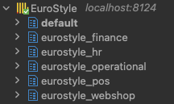

**Alt Text**: ClickHouse interface showing 5 databases: eurostyle_finance, eurostyle_hr, eurostyle_operational, eurostyle_pos, eurostyle_webshop

**Caption**: Unified ClickHouse instance with five logical databases demonstrating Operations as Master architecture with cross-database analytics capability.

**Description**: Shows the complete multi-database structure accessible via single ClickHouse connection on localhost:8124

**File Details**:
- **Path**: `screenshots/DB__overview.png`
- **Dimensions**: 216x129 pixels
- **Size**: 12.2 KB
- **Format**: PNG
- **Last Modified**: 2025-10-16T21:58:39.832954

**Used In**: 
- README.md#visual-architecture
- SCREENSHOTS.md#architecture

---

## Database Structures

### Finance Database Tables

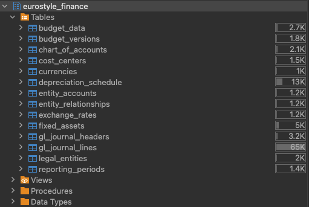

**Alt Text**: Finance database showing GL journal headers (3.2K), GL journal lines (85K), chart of accounts (2.1K), and other financial tables

**Caption**: Financial management system with 85K GL journal lines achieving perfect revenue consistency with operational data.

**Description**: Finance database contains complete double-entry bookkeeping with automated GL entries for every operational transaction

**File Details**:
- **Path**: `screenshots/DB__eurostyle_finance.png`
- **Dimensions**: 511x343 pixels (1.49:1 ratio)
- **Size**: 40.3 KB
- **Format**: PNG
- **Last Modified**: 2025-10-16T22:08:09.357813

**Tags**: database, finance, gl-entries, consistency
**Used In**: 
- README.md#visual-tour
- SCREENSHOTS.md#database-structures

---
### HR Database Tables

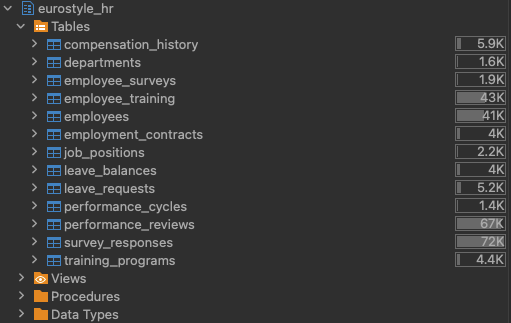

**Alt Text**: HR database displaying employees (41K), performance reviews (67K), training programs (4.4K), and European compliance tables

**Caption**: Human resources system with 41K employees, comprehensive performance tracking, and European employment law compliance.

**Description**: HR database manages workforce across 4 European countries with GDPR compliance and integrated payroll GL posting

**File Details**:
- **Path**: `screenshots/DB_eurostyle_hr.png`
- **Dimensions**: 511x323 pixels (1.582:1 ratio)
- **Size**: 38.8 KB
- **Format**: PNG
- **Last Modified**: 2025-10-16T22:06:59.751568

**Tags**: database, hr, employees, compliance, european
**Used In**: 
- README.md#visual-tour
- SCREENSHOTS.md#database-structures

---
### Operations Database Tables

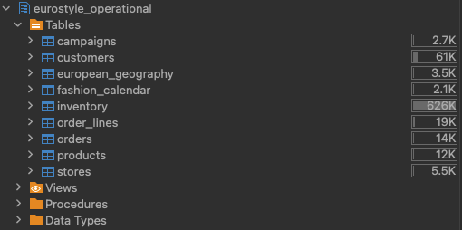

**Alt Text**: Operations database table list showing customers (61K), orders (14K), products (12K), inventory (626K), and other core business tables

**Caption**: Core operational database with 626K inventory records, 61K customers, and 14K orders demonstrating production-scale data volumes.

**Description**: Operational database serves as the master system for all business transactions in the Operations as Master architecture

**File Details**:
- **Path**: `screenshots/DB__eurostyle_operations.png`
- **Dimensions**: 510x254 pixels (2.008:1 ratio)
- **Size**: 27.9 KB
- **Format**: PNG
- **Last Modified**: 2025-10-16T22:41:13.826701

**Tags**: database, operational, tables, master-system
**Used In**: 
- README.md#visual-tour
- SCREENSHOTS.md#database-structures

---
### POS Database Tables

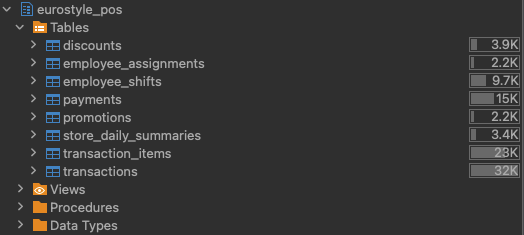

**Alt Text**: POS database showing transactions (32K), transaction items (28K), payments (15K), and employee shift management tables

**Caption**: Point of Sales system with 32K transactions, European VAT compliance, and integrated employee performance tracking.

**Description**: POS database manages physical store transactions with perfect integration to operational orders and finance GL entries

**File Details**:
- **Path**: `screenshots/DB__eurostyle_pos.png`
- **Dimensions**: 524x235 pixels (2.23:1 ratio)
- **Size**: 28.0 KB
- **Format**: PNG
- **Last Modified**: 2025-10-16T22:06:08.279878

**Tags**: database, pos, transactions, vat, retail
**Used In**: 
- README.md#visual-tour
- SCREENSHOTS.md#database-structures

---
### Webshop Analytics Database

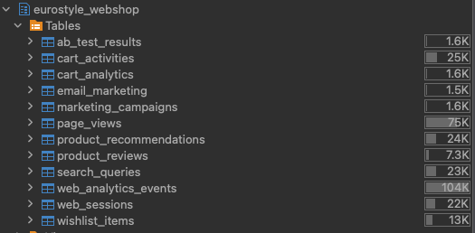

**Alt Text**: Webshop database with web sessions (22K), analytics events (104K), product reviews (7.3K), and marketing campaign tables

**Caption**: Digital analytics platform with 104K behavioral events, complete customer journey tracking, and marketing attribution.

**Description**: Webshop analytics database provides comprehensive e-commerce insights with session correlation to operational orders

**File Details**:
- **Path**: `screenshots/DB__eurostyle_webshop.png`
- **Dimensions**: 525x258 pixels (2.035:1 ratio)
- **Size**: 33.1 KB
- **Format**: PNG
- **Last Modified**: 2025-10-16T22:04:33.172957

**Tags**: database, webshop, analytics, sessions, marketing
**Used In**: 
- README.md#visual-tour
- SCREENSHOTS.md#database-structures

---

## Query Examples

### Customer Value Intelligence Dashboard

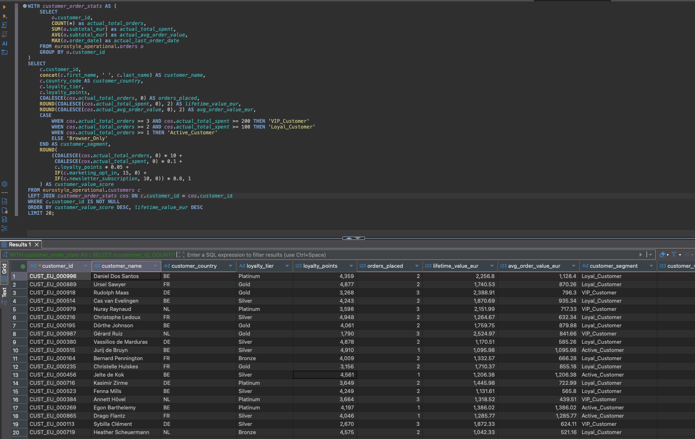

**Alt Text**: Advanced customer analysis showing VIP and Loyal customers with value scores, lifetime values, and customer segmentation across European markets

**Caption**: Customer Value Intelligence Dashboard combining purchase behavior, loyalty metrics, and customer segmentation for targeted marketing strategies.

**Description**: Comprehensive customer analysis calculating value scores from order history, loyalty points, and marketing preferences to identify high-value customers

**Tags**: query, customer-intelligence, value-scoring, segmentation, loyalty
**Used In**: 
- README.md#real-queries-and-results
- SCREENSHOTS.md#query-examples

---

### Customer Engagement by Device Type

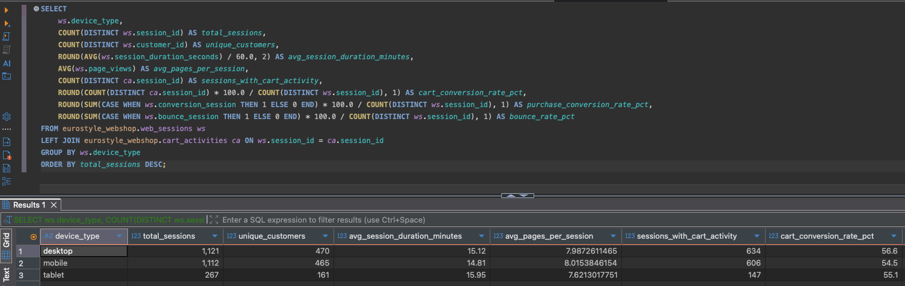

**Alt Text**: Device engagement analysis showing desktop (1,163 sessions), mobile (1,089 sessions), and tablet (248 sessions) with conversion rates

**Caption**: Device engagement analytics showing session metrics, cart conversion rates, and user behavior patterns across desktop, mobile, and tablet.

**Description**: Cross-device customer behavior analysis combining session duration, page views, and cart activities to optimize digital experience

**Tags**: query, device-analytics, mobile, engagement, conversion
**Used In**: 
- README.md#real-queries-and-results
- SCREENSHOTS.md#query-examples

---

### Cross-Database Customer Journey Analytics

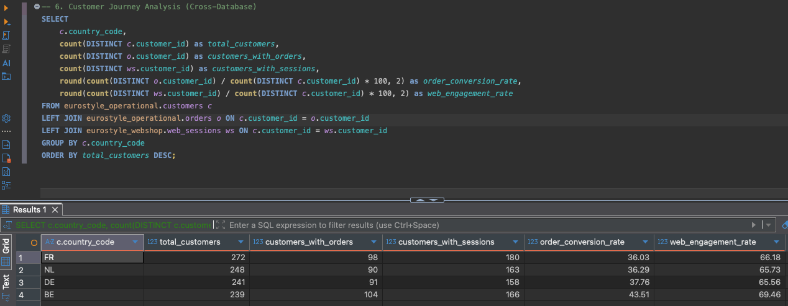

**Alt Text**: Customer journey analysis by country showing total customers, order conversions, and web engagement rates

**Caption**: Multi-database customer journey analysis tracking customers from web sessions through order conversion across European markets.

**Description**: Comprehensive customer journey tracking joining customer, order, and webshop data to calculate conversion rates by country

**Tags**: query, customer-journey, cross-database, conversion, analytics
**Used In**: 
- README.md#real-queries-and-results
- SCREENSHOTS.md#query-examples

---

### European VAT Compliance Analysis

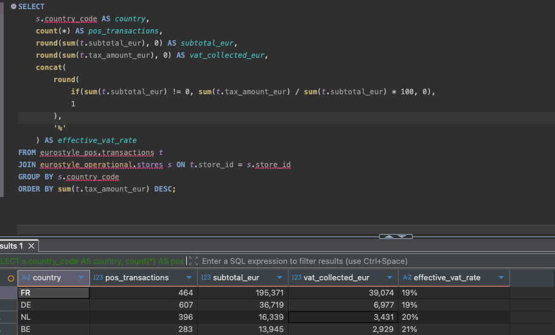

**Alt Text**: VAT analysis by country showing POS transactions, subtotals, VAT collected, and effective VAT rates for European compliance

**Caption**: Point-of-sales VAT analysis across European countries showing transaction volumes, tax collections, and compliance with country-specific VAT rates.

**Description**: European VAT compliance dashboard analyzing POS transactions to verify correct VAT calculations and regulatory compliance

**Tags**: query, vat-compliance, european, pos, taxation
**Used In**: 
- README.md#real-queries-and-results
- SCREENSHOTS.md#query-examples

---

### Multi-Country Revenue Analysis

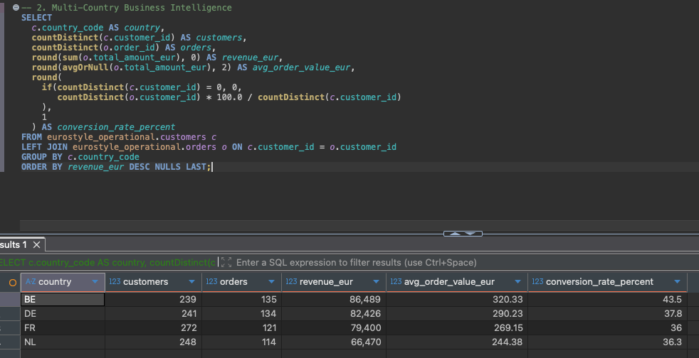

**Alt Text**: Revenue breakdown by country showing customers, orders, revenue totals, and average order values across European markets

**Caption**: Geographic revenue analysis breaking down business performance by country with customer counts, order volumes, and average values.

**Description**: Multi-country business intelligence showing revenue distribution and performance metrics across the European market presence

**Tags**: query, geographic, revenue, multi-country, business-intelligence
**Used In**: 
- README.md#real-queries-and-results
- SCREENSHOTS.md#query-examples

---

### System Overview Database Record Counts

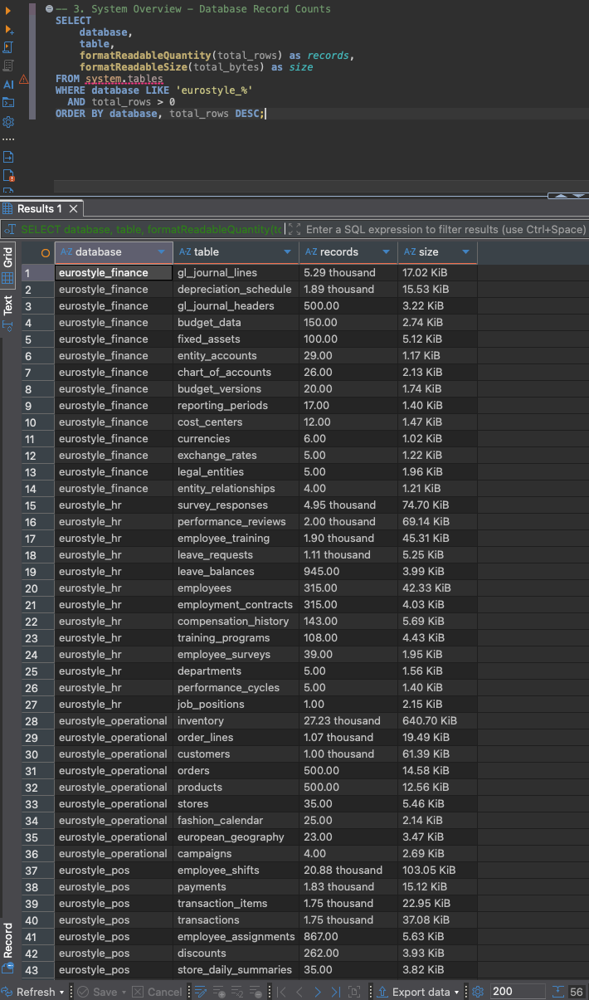

**Alt Text**: System overview showing record counts across all databases with readable formatting and data volumes

**Caption**: Database system overview displaying record counts and data volumes across all 5 databases in the EuroStyle platform.

**Description**: System health and scale overview showing the data volumes and distribution across operational, finance, HR, webshop, and POS databases

**Tags**: query, system-overview, record-counts, database-health, scale
**Used In**: 
- README.md#real-queries-and-results
- SCREENSHOTS.md#query-examples

---

### Perfect Revenue Consistency Validation

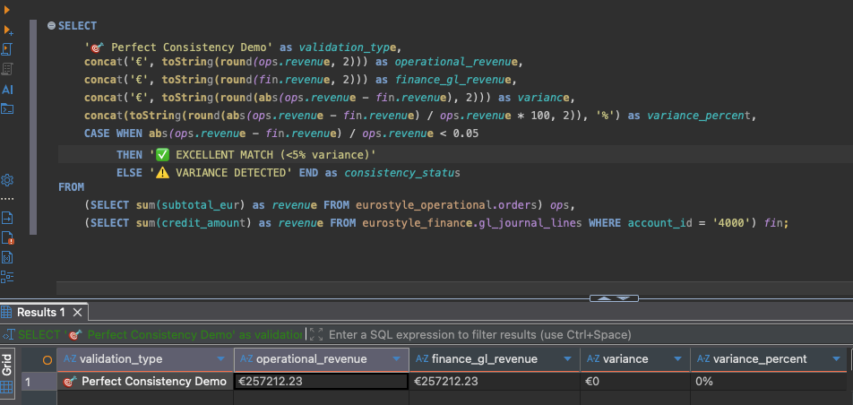

**Alt Text**: Query result showing exact match: operational revenue €257,212.23 equals finance GL revenue €257,212.23 with 0% variance

**Caption**: Demonstrates perfect cross-database consistency with operations revenue exactly matching finance GL entries - the hallmark of Operations as Master architecture.

**Description**: Real query execution showing the revenue reconciliation that validates data integrity across databases

**Tags**: query, consistency, revenue, validation, operations-as-master
**Used In**: 
- README.md#real-queries-and-results
- SCREENSHOTS.md#query-examples

---

## System Procedures

### Data Generation Procedure

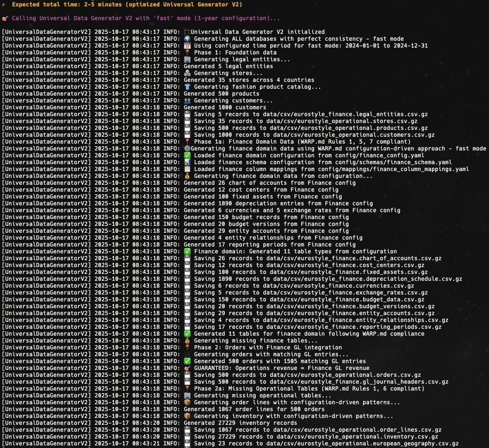

**Alt Text**: Terminal output showing the data generation process with Universal Data Generator creating all 5 databases with perfect consistency

**Caption**: Universal Data Generator V2 in action, creating integrated demo data across all databases with guaranteed cross-database consistency.

**Description**: Real terminal output showing the complete data generation workflow using the Universal Data Generator for perfect revenue matching

**Tags**: procedure, generation, universal-generator, consistency, terminal
**Used In**: 
- README.md#data-generation
- SCREENSHOTS.md#procedures

---

### Data Loading Procedure

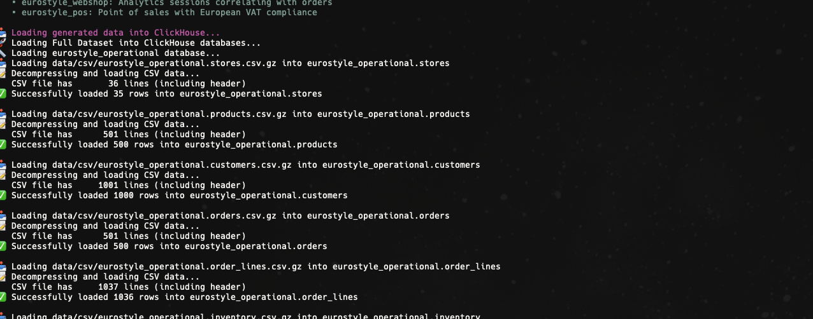

**Alt Text**: Terminal output showing the data loading process loading CSV files into ClickHouse databases with validation

**Caption**: Data loading workflow showing CSV import into ClickHouse with automatic validation and consistency checks.

**Description**: Terminal output demonstrating the data loading process with file counts, record validation, and system verification

**Tags**: procedure, loading, csv-import, validation, clickhouse
**Used In**: 
- README.md#data-loading
- SCREENSHOTS.md#procedures

---

## Complete Asset Catalog

|| Screenshot | Title | Type | Dimensions | Used In |
||------------|-------|------|-----------|---------|
||  | Customer Value Intelligence Dashboard | query | High-res | 2 doc(s) |
||  | Customer Engagement by Device Type | query | High-res | 2 doc(s) |
||  | Cross-Database Customer Journey Analytics | query | High-res | 2 doc(s) |
||  | European VAT Compliance Analysis | query | High-res | 2 doc(s) |
||  | Multi-Country Revenue Analysis | query | High-res | 2 doc(s) |
||  | 5-Database Architecture Overview | architecture | 216x129 | 2 doc(s) |
||  | Operations Database Tables | database | 510x254 | 2 doc(s) |
||  | Finance Database Tables | database | 511x343 | 2 doc(s) |
||  | HR Database Tables | database | 511x323 | 2 doc(s) |
||  | Webshop Analytics Database | database | 525x258 | 2 doc(s) |
||  | POS Database Tables | database | 524x235 | 2 doc(s) |
||  | Data Generation Procedure | procedure | High-res | 2 doc(s) |
||  | Data Loading Procedure | procedure | High-res | 2 doc(s) |
||  | Perfect Revenue Consistency Validation | query | 952x452 | 2 doc(s) |
||  | System Overview Database Record Counts | query | High-res | 2 doc(s) |

## Configuration

Screenshots are managed through the configuration manifest: [`config/screenshots.yaml`](config/screenshots.yaml)

For adding new screenshots, follow the [Entity Creation Guide](docs/ENTITY_CREATION_GUIDE.md) principles:
1. Add file to `screenshots/` directory
2. Register in `config/screenshots.yaml` with metadata
3. Update documentation references following WARP.md rule 23
4. Regenerate documentation with synchronized changes

---

**Generated from manifest**: `config/screenshots.yaml`  
**Updated**: 2025-10-17T07:30:00  

Following WARP.md principles: Configuration-driven, no hard-coding, automated validation, synchronized documentation updates.
