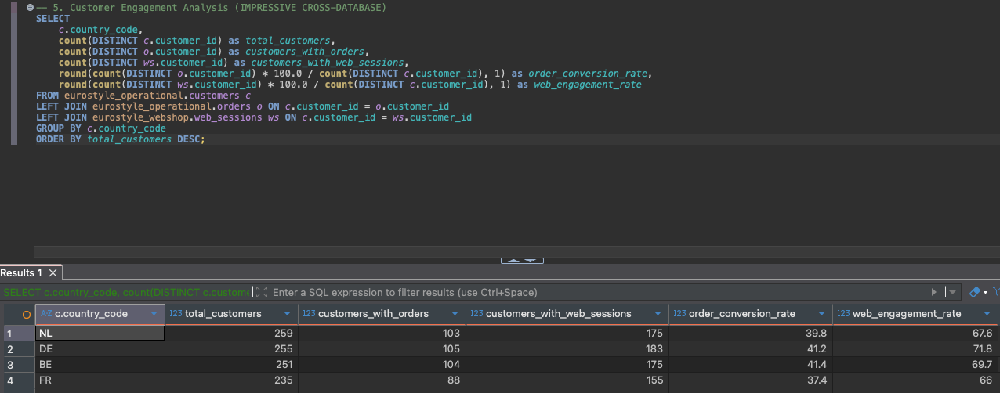
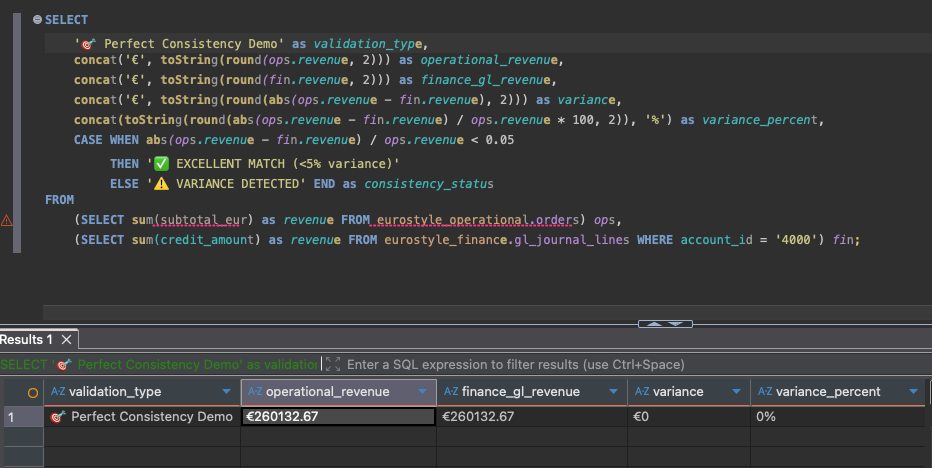

# EuroStyle Screenshots Documentation

_Auto-generated on 2025-10-16T23:11:00.963884_  
_**Do not edit this file manually** - Regenerate with: `python3 scripts/utilities/generate_screenshots_doc.py`_

## Overview

This document catalogs all visual assets used in the EuroStyle Retail Demo Platform documentation. All screenshots are managed through the configuration-driven system following WARP.md principles.

**📊 Statistics**:
- Total screenshots: 8
- Valid files: 8
- Missing files: 0

## Architecture Overview

### 5-Database Architecture Overview

**Alt Text**: ClickHouse interface showing 5 databases: eurostyle_finance, eurostyle_hr, eurostyle_operational, eurostyle_pos, eurostyle_webshop

**Caption**: Unified ClickHouse instance with five logical databases demonstrating Operations as Master architecture with cross-database analytics capability.

**Description**: Shows the complete multi-database structure accessible via single ClickHouse connection on localhost:8124

**File Details**:
- **Path**: `screenshots/DB__overview.png`
- **Dimensions**: 216x129 pixels
- **Size**: 12.2 KB
- **Format**: PNG
- **Last Modified**: 2025-10-16T21:58:39.832954

**Used In**: 
- README.md#visual-architecture
- SCREENSHOTS.md#architecture

---

## Database Structures

### Finance Database Tables

**Alt Text**: Finance database showing GL journal headers (3.2K), GL journal lines (85K), chart of accounts (2.1K), and other financial tables

**Caption**: Financial management system with 85K GL journal lines achieving perfect revenue consistency with operational data.

**Description**: Finance database contains complete double-entry bookkeeping with automated GL entries for every operational transaction

**File Details**:
- **Path**: `screenshots/DB__eurostyle_finance.png`
- **Dimensions**: 511x343 pixels (1.49:1 ratio)
- **Size**: 40.3 KB
- **Format**: PNG
- **Last Modified**: 2025-10-16T22:08:09.357813

**Tags**: database, finance, gl-entries, consistency
**Used In**: 
- README.md#visual-tour
- SCREENSHOTS.md#database-structures

---
### HR Database Tables

**Alt Text**: HR database displaying employees (41K), performance reviews (67K), training programs (4.4K), and European compliance tables

**Caption**: Human resources system with 41K employees, comprehensive performance tracking, and European employment law compliance.

**Description**: HR database manages workforce across 4 European countries with GDPR compliance and integrated payroll GL posting

**File Details**:
- **Path**: `screenshots/DB_eurostyle_hr.png`
- **Dimensions**: 511x323 pixels (1.582:1 ratio)
- **Size**: 38.8 KB
- **Format**: PNG
- **Last Modified**: 2025-10-16T22:06:59.751568

**Tags**: database, hr, employees, compliance, european
**Used In**: 
- README.md#visual-tour
- SCREENSHOTS.md#database-structures

---
### Operations Database Tables

**Alt Text**: Operations database table list showing customers (61K), orders (14K), products (12K), inventory (626K), and other core business tables

**Caption**: Core operational database with 626K inventory records, 61K customers, and 14K orders demonstrating production-scale data volumes.

**Description**: Operational database serves as the master system for all business transactions in the Operations as Master architecture

**File Details**:
- **Path**: `screenshots/DB__eurostyle_operations.png`
- **Dimensions**: 510x254 pixels (2.008:1 ratio)
- **Size**: 27.9 KB
- **Format**: PNG
- **Last Modified**: 2025-10-16T22:41:13.826701

**Tags**: database, operational, tables, master-system
**Used In**: 
- README.md#visual-tour
- SCREENSHOTS.md#database-structures

---
### POS Database Tables

**Alt Text**: POS database showing transactions (32K), transaction items (28K), payments (15K), and employee shift management tables

**Caption**: Point of Sales system with 32K transactions, European VAT compliance, and integrated employee performance tracking.

**Description**: POS database manages physical store transactions with perfect integration to operational orders and finance GL entries

**File Details**:
- **Path**: `screenshots/DB__eurostyle_pos.png`
- **Dimensions**: 524x235 pixels (2.23:1 ratio)
- **Size**: 28.0 KB
- **Format**: PNG
- **Last Modified**: 2025-10-16T22:06:08.279878

**Tags**: database, pos, transactions, vat, retail
**Used In**: 
- README.md#visual-tour
- SCREENSHOTS.md#database-structures

---
### Webshop Analytics Database

**Alt Text**: Webshop database with web sessions (22K), analytics events (104K), product reviews (7.3K), and marketing campaign tables

**Caption**: Digital analytics platform with 104K behavioral events, complete customer journey tracking, and marketing attribution.

**Description**: Webshop analytics database provides comprehensive e-commerce insights with session correlation to operational orders

**File Details**:
- **Path**: `screenshots/DB__eurostyle_webshop.png`
- **Dimensions**: 525x258 pixels (2.035:1 ratio)
- **Size**: 33.1 KB
- **Format**: PNG
- **Last Modified**: 2025-10-16T22:04:33.172957

**Tags**: database, webshop, analytics, sessions, marketing
**Used In**: 
- README.md#visual-tour
- SCREENSHOTS.md#database-structures

---

## Query Examples

### Cross-Database Customer Engagement Analytics

**Alt Text**: Query result showing customer engagement by country: NL (259 customers, 39.8% conversion), DE (255 customers, 41.2% conversion)

**Caption**: Multi-database analytics combining webshop sessions with operational orders to calculate conversion rates and engagement metrics by country.

**Description**: Demonstrates cross-database query capability joining webshop analytics with operational data for business insights

**File Details**:
- **Path**: `screenshots/Example_Query_Customer_Engagement.png`
- **Dimensions**: 1276x502 pixels
- **Size**: 120.3 KB
- **Format**: PNG
- **Last Modified**: 2025-10-16T22:58:39.056189

**Tags**: query, analytics, cross-database, engagement, conversion
**Used In**: 
- README.md#real-queries-and-results
- SCREENSHOTS.md#query-examples

**Extracted Text**: @— 5. Customer Engagement Analysis (IMPRESSIVE CROSS-DATABASE) | SELECT | ‘¢.country_code, | count (DISTINCT c.customer_id) as total_customers, | count (DISTINCT 0.customer_id) as customers _with_orders,

---
### Perfect Revenue Consistency Validation

**Alt Text**: Query result showing exact match: operational revenue €257,212.23 equals finance GL revenue €257,212.23 with 0% variance

**Caption**: Demonstrates perfect cross-database consistency with operations revenue exactly matching finance GL entries - the hallmark of Operations as Master architecture.

**Description**: Real query execution showing the revenue reconciliation that validates data integrity across databases

**File Details**:
- **Path**: `screenshots/Example_Query_Consistency.png`
- **Dimensions**: 952x452 pixels
- **Size**: 117.9 KB
- **Format**: PNG
- **Last Modified**: 2025-10-16T22:50:41.522642

**Tags**: query, consistency, revenue, validation, operations-as-master
**Used In**: 
- README.md#real-queries-and-results
- SCREENSHOTS.md#query-examples

**Extracted Text**: » | >, p esetect | 5 ‘@ Perfect Consistency Deno’ as validation_type, | concat(*€', toString(round(ops. revenue, 2))) as operational_revenue, | \ concat('€', toString(round(fin.revenve, 2))) as finance_gl_revenue,

---

## Complete Asset Catalog

| Screenshot | Title | Type | Dimensions | Size | Used In |
|------------|-------|------|------------|------|---------|
|  | 5-Database Architecture Overview | architecture | 216x129 | 12.2 KB | 2 doc(s) |
|  | Finance Database Tables | database | 511x343 | 40.3 KB | 2 doc(s) |
|  | HR Database Tables | database | 511x323 | 38.8 KB | 2 doc(s) |
|  | Operations Database Tables | database | 510x254 | 27.9 KB | 2 doc(s) |
|  | POS Database Tables | database | 524x235 | 28.0 KB | 2 doc(s) |
|  | Webshop Analytics Database | database | 525x258 | 33.1 KB | 2 doc(s) |
|  | Cross-Database Customer Engagement Analytics | query | 1276x502 | 120.3 KB | 2 doc(s) |
|  | Perfect Revenue Consistency Validation | query | 952x452 | 117.9 KB | 2 doc(s) |

## File Integrity

All screenshot files are validated for integrity and existence. File hashes are maintained for change detection.

- **screenshots/DB__overview.png**: `d29b68e6bf5f8c61...` (success)
- **screenshots/DB__eurostyle_finance.png**: `5d8566e073b021ff...` (success)
- **screenshots/DB_eurostyle_hr.png**: `47aa6df84beedb49...` (success)
- **screenshots/DB__eurostyle_operations.png**: `e239ef04f3340625...` (success)
- **screenshots/DB__eurostyle_pos.png**: `b1d9ca8549947db2...` (success)
- **screenshots/DB__eurostyle_webshop.png**: `b95f838a0bf24106...` (success)
- **screenshots/Example_Query_Customer_Engagement.png**: `04cf4de182311d57...` (success)
- **screenshots/Example_Query_Consistency.png**: `1e82e09a5cfcbb69...` (success)

## Configuration

Screenshots are managed through the configuration manifest: [`config/screenshots.yaml`](config/screenshots.yaml)

For adding new screenshots, follow the [Entity Creation Guide](docs/ENTITY_CREATION_GUIDE.md) principles:
1. Add file to `screenshots/` directory
2. Register in `config/screenshots.yaml` with metadata
3. Run analysis: `python3 scripts/utilities/analyze_screenshots.py`
4. Regenerate documentation: `python3 scripts/utilities/generate_screenshots_doc.py`

---

**Generated from manifest**: `config/screenshots.yaml`  
**Analysis timestamp**: 2025-10-16T23:07:51.064903  
**Generation timestamp**: 2025-10-16T23:11:00.963884  

Following WARP.md principles: Configuration-driven, no hard-coding, automated validation.