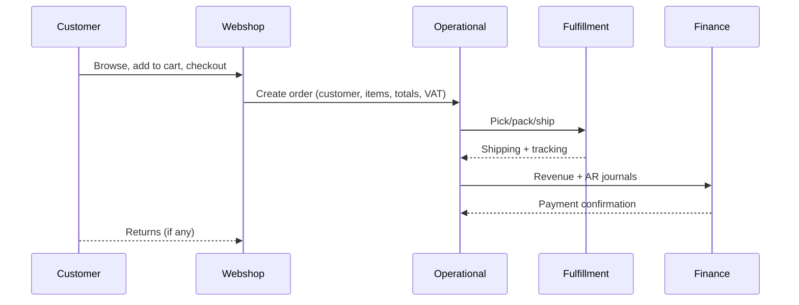
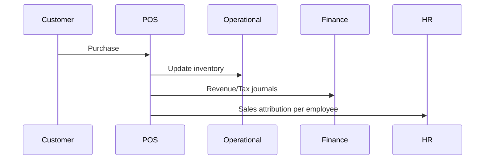

# Business Processes

## Order‑to‑Cash (E‑commerce)

Key controls: identity, consent, VAT, payment capture, returns window, reconciliation.

## Order‑to‑Cash (Store / POS)

Key controls: receipt sequencing, VAT mapping, POS payment integrity, commission logic.

## Purchase‑to‑Pay (Conceptual)
- Replenishment planning → Purchase order → Goods receipt → Invoice and 3‑way match → Payment
- Future sources: suppliers, lead times, cost price validation, landed costs

## Inventory Replenishment
- Forecast demand → Set reorder levels → Reallocate across stores → Expedite exceptions

## Returns & Refunds
- Initiate return → Eligibility and condition check → Refund/credit memo → Stock disposition

## Product Lifecycle Management
- New style setup → Launch → Markdown management → End‑of‑life → Archival

## Hire‑to‑Retire (HR)
- Recruiting → Onboarding → Scheduling/assignment → Performance & training → Offboarding

## Record‑to‑Report (Finance)
- Daily journals → Month‑end close → Consolidation → Reconciliation (Ops/POS ↔ Finance)

## Data Lineage Highlights
- Customers → Orders (Operational) → Finance GL
- Sessions → Orders (Webshop linkage) → Marketing attribution
- POS Items → Products (cost, margin) → Employee performance
