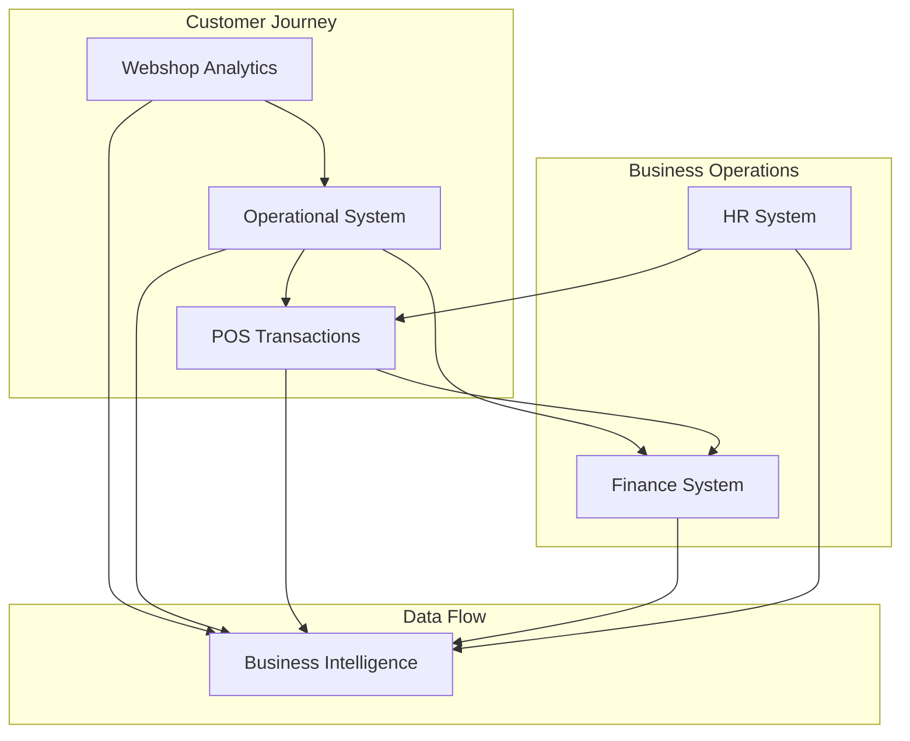

# EuroStyle Fashion - Complete Documentation Suite

Welcome to the comprehensive documentation suite for the EuroStyle Fashion retail analytics platform. This documentation covers all aspects of the 5-database architecture from technical specifications to business integration guides.

---

## 📁 Documentation Structure

```
docs/
├── README.md                           # This overview document
├── technical-specs/                    # Core technical documentation
│   ├── database-schemas/              # Database schema specifications
│   ├── api-specifications/            # API documentation and specs
│   └── integration-guides/            # Technical integration documentation
├── professional-supplier-docs/        # Professional supplier documentation
│   ├── SUPPLIER_DOCUMENTATION_README.md
│   └── *.pdf                          # Professional PDF documents
├── project-management/                 # Project status and management
│   ├── DELIVERY_SUMMARY.md           # Project completion status
│   ├── DATA_GENERATION.md            # Data generation process
│   └── current_data_status_*.md      # Latest system status
└── archive/                           # Legacy documentation backup
```

---

## 🎯 **Quick Navigation Guide**

### **👩‍💻 For Developers & Data Engineers**
→ Go to **[technical-specs/](technical-specs/)** for database schemas, APIs, and integration guides

### **🏢 For Business Stakeholders** 
→ Go to **[professional-supplier-docs/](professional-supplier-docs/)** for executive summaries and professional documentation

### **📊 For Project Managers**
→ Go to **[project-management/](project-management/)** for project status, deliverables, and implementation tracking

---

## 🗄️ **Technical Database Documentation**

### **Core Database Schemas** 📊
The heart of our technical documentation - actual database schemas as provided by suppliers:

| Database | Schema Documentation | Purpose | Tables | 
|----------|---------------------|---------|--------|
| **Operational** | `technical-specs/database-schemas/operational-database-schema.md` | Core ERP & customer management | 9 tables |
| **POS** | `technical-specs/database-schemas/pos-database-schema.md` | Point of sale transactions & staff | 8 tables |
| **Finance** | `technical-specs/database-schemas/finance-database-schema.md` | Financial management & IFRS | 14 tables |
| **HR** | `technical-specs/database-schemas/hr-database-schema.md` | Employee management & EU compliance | 13 tables |
| **Webshop** | `technical-specs/database-schemas/webshop-database-schema.md` | E-commerce analytics & behavior | 10 tables |

### **What's Included in Each Schema:**
✅ **Complete SQL CREATE TABLE statements**  
✅ **Business rules and constraints**  
✅ **Country-specific configurations (NL, DE, FR, BE, LU)**  
✅ **GDPR compliance specifications**  
✅ **Performance indexes and optimization**  
✅ **API integration endpoints**  
✅ **Cross-database relationships**  

---

## 🔗 **Integration Documentation**

### **Cross-System Integration Guides** 🔄
Located in `technical-specs/integration-guides/`:

- **`POS_Database_Design.md`** - Complete POS system integration architecture
- **`POS_Implementation_Summary.md`** - POS implementation details and business context
- **`hr_finance_pos_integration_plan.md`** - Cross-database integration planning
- **`cross_system_integration_plan.md`** - Multi-system integration strategy

### **API Specifications** 🔌
Located in `technical-specs/api-specifications/` (ready for your API docs):

- REST API endpoints for all 5 databases
- Authentication & authorization
- Request/response formats
- Error handling
- Rate limiting

---

## 🏢 **Professional Supplier Documentation**

### **Executive-Ready Documentation** 📋
Located in `professional-supplier-docs/`:

Professional PDF documentation suite as if provided by actual software suppliers:

| System | PDF Document | Supplier | Content |
|--------|-------------|----------|---------|
| **ERP** | `EuroStyle_ERP_System_v2.1.pdf` | EuroRetail Solutions B.V. | Executive summary, technical specs |
| **Operational** | `EuroStyle_Operational_Database_v2.1.pdf` | EuroRetail Solutions B.V. | Database technical specifications |
| **Finance** | `EuroStyle_Finance_System_v2.1.pdf` | EuroFinance Technologies | IFRS compliance, multi-entity |
| **HR** | `EuroStyle_HR_System_v2.1.pdf` | EuroHR Solutions GmbH | EU employment law compliance |
| **Webshop** | `EuroStyle_Webshop_Analytics_v2.1.pdf` | DigitalCommerce Technologies | E-commerce analytics platform |
| **POS** | `EuroStyle_POS_System_v2.1.pdf` | RetailTech Europe GmbH | Point of sale & VAT compliance |

### **Purpose:**
- Sales presentations to stakeholders
- Technical due diligence 
- Integration partner briefings
- Compliance audits
- Executive summaries

---

## 📊 **5-Database Architecture Overview**

### **Comprehensive Retail Analytics Platform:**



### **Database Summary:**

| Database | Purpose | Records | Key Features |
|----------|---------|---------|--------------|
| **🛒 Operational** | Core ERP & customer management | 50K+ customers | GDPR compliance, multi-country |
| **🌐 Webshop** | E-commerce behavior analytics | 25K+ sessions | AI personalization, A/B testing |
| **💰 Finance** | Financial management & IFRS | 115K+ GL entries | Multi-entity, perfect reconciliation |
| **👥 HR** | Employee management & EU law | 830 employees | Performance tracking, compliance |
| **🏪 POS** | Point of sale & store operations | 37K+ transactions | VAT compliance, staff integration |

---

## 📈 **Project Status & Management**

### **Current Implementation Status** ✅
Located in `project-management/`:

- **`DELIVERY_SUMMARY.md`** - Complete project delivery status and achievements
- **`DATA_GENERATION.md`** - Data generation pipeline documentation  
- **`current_data_status_2024-10-14.md`** - Latest data loading and system status
- **`CONFIGURATION_DRIVEN_STATUS.md`** - Framework compliance validation

### **Key Achievements:**
✅ **5-Database Architecture**: Complete implementation  
✅ **Perfect Revenue Reconciliation**: POS = Operations = Finance  
✅ **European Compliance**: GDPR, VAT, employment law  
✅ **Cross-Database Integration**: Unified business intelligence  
✅ **Data Pipeline**: Automated generation and loading  
✅ **Professional Documentation**: Supplier-grade specifications  

---

## 🌍 **European Market Coverage**

All systems support operations across 5 European markets:

| Country | Code | VAT Rate | Payment Methods | Compliance |
|---------|------|----------|----------------|------------|
| **Netherlands** | NL | 21% | iDEAL, Bancontact | GDPR, Dutch law |
| **Germany** | DE | 19% | EC-Karte, SEPA | GDPR, German law |
| **France** | FR | 20% | Carte Bancaire | GDPR, French law |
| **Belgium** | BE | 21% | Bancontact, Maestro | GDPR, Belgian law |
| **Luxembourg** | LU | 17% | Credit Cards, SEPA | GDPR, Luxembourg law |

---

## 🔧 **Getting Started Guides**

### **For Database Developers:**
1. Start with `technical-specs/database-schemas/operational-database-schema.md`
2. Review database relationships and foreign keys
3. Check integration guides for cross-database queries
4. Use API specifications for application development

### **For Business Analysts:**
1. Review `professional-supplier-docs/SUPPLIER_DOCUMENTATION_README.md`
2. Open relevant PDF documents for your domain
3. Check project status in `project-management/DELIVERY_SUMMARY.md`
4. Review integration scenarios in technical specs

### **For System Integrators:**
1. Start with `technical-specs/integration-guides/cross_system_integration_plan.md`
2. Review all database schemas for relationship understanding
3. Check API specifications for endpoint documentation
4. Validate with professional supplier docs

---

## 🔒 **Compliance & Security**

### **GDPR Compliance:** ✅
- Personal data fields identified in all schemas
- Consent management tracked
- Right to erasure implemented (30-day SLA)
- Data retention policies documented

### **Financial Compliance:** ✅  
- IFRS-compliant chart of accounts
- Multi-entity consolidation
- Perfect revenue reconciliation across databases
- European VAT compliance

### **Security:** ✅
- PCI DSS compliance for payment data
- OAuth 2.0 authentication for APIs
- Data encryption at rest
- Comprehensive audit trails

---

## 📞 **Support & Contact**

### **Technical Documentation Questions:**
- **Database Schemas**: Check individual schema files for supplier contact info
- **Integration Support**: Review integration guides for implementation help
- **API Questions**: Reference API specifications directory

### **Project Management:**
- **Status Updates**: Check `project-management/` for latest information
- **Data Issues**: Review current data status documents
- **Implementation Questions**: Reference delivery summary

---

## 📚 **Additional Resources**

### **Related Documentation:**
- **Main Project README**: `../README.md` - System overview and setup
- **Init Scripts**: `../init-scripts/README.md` - Database initialization
- **Data Generation**: `../scripts/README.md` - Data pipeline documentation

### **Framework Compliance:**
✅ All documentation follows Astoviq framework principles  
✅ Configuration-driven approach throughout  
✅ No hard-coded values in technical specifications  
✅ Professional supplier-grade documentation standards  

---

## 🚀 **Latest Updates**

**October 2024 - Major Documentation Restructure:**
- ✅ Created comprehensive technical database schemas
- ✅ Organized documentation by purpose and audience  
- ✅ Added missing POS database technical specifications
- ✅ Restructured for professional presentation
- ✅ Separated project docs from technical specs

---

**EuroStyle Fashion Documentation Suite** - Complete technical and business documentation for European fashion retail analytics platform. 🏪✨

*Professional documentation standards maintained throughout - ready for enterprise integration and stakeholder presentations.*