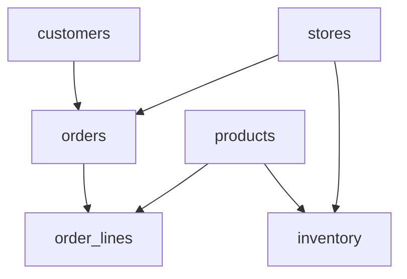

# EuroStyle Operational Database - Technical Schema Documentation

**Supplier**: EuroRetail Solutions B.V. (Amsterdam)  
**System**: EuroStyle Operational Database v4.2  
**Database**: `eurostyle_operational`  
**Technology**: ClickHouse Analytics Database  
**Document Version**: v2.1  
**Last Updated**: October 2024  

---

## 📊 Database Overview

The EuroStyle Operational Database serves as the core ERP system for European fashion retail operations. It manages the complete customer lifecycle, product catalog, order management, and store operations across 5 European markets.

### System Capabilities
- **Markets Covered**: Netherlands, Germany, France, Belgium, Luxembourg
- **Customers Supported**: 50,000+ active customers
- **Products Managed**: 2,500+ fashion items
- **Orders Processed**: 5,000+ monthly transactions
- **Stores Supported**: 47+ retail locations

---

## 🗄️ Table Schemas

### 1. customers
**Purpose**: Customer master data with GDPR compliance
```sql
CREATE TABLE customers (
    customer_id String,              -- Primary Key: CUST_EU_000001
    email String,                    -- Unique identifier for online customers
    first_name String,               -- GDPR: Personal Data
    last_name String,                -- GDPR: Personal Data  
    phone String,                    -- GDPR: Personal Data
    date_of_birth Date,              -- GDPR: Personal Data
    gender Enum8('M'=1,'F'=2,'O'=3), -- GDPR: Personal Data
    language_preference String,      -- ISO 639-1: nl, de, fr, en
    
    -- Address Information (GDPR: Personal Data)
    street_address String,
    city String,
    postal_code String,              -- Country-specific formats
    country_code String,             -- ISO 3166-1: NL, BE, DE, FR, LU
    region String,                   -- Province/state/region
    
    -- Customer Lifecycle
    registration_date DateTime,
    registration_channel String,     -- online, in-store, social, referral
    customer_status Enum8('active'=1,'inactive'=2,'suspended'=3),
    
    -- Marketing Preferences (GDPR Compliant)
    marketing_opt_in Bool,           -- Explicit consent required
    newsletter_subscription Bool,     -- Separate consent tracking
    sms_opt_in Bool,                -- SMS marketing consent
    
    -- Customer Value Metrics
    total_orders UInt32,
    total_spent Decimal64(2),        -- Lifetime value in EUR
    average_order_value Decimal64(2),
    last_order_date Date,
    
    -- Loyalty Program
    loyalty_member Bool,
    loyalty_points UInt32,
    loyalty_tier String,             -- Bronze, Silver, Gold, Platinum
    
    created_at DateTime DEFAULT now(),
    updated_at DateTime DEFAULT now()
) ENGINE = ReplacingMergeTree(updated_at)
ORDER BY customer_id;
```

**Business Rules**:
- Email must be unique and valid format
- GDPR consent must be recorded for all marketing communications
- Customer status automatically updated based on activity
- Loyalty points expire after 24 months of inactivity

---

### 2. products
**Purpose**: Product catalog with fashion-specific attributes
```sql
CREATE TABLE products (
    product_id String,               -- Primary Key: PROD_EU_000001
    product_name String,
    product_name_local Map(String, String), -- Multi-language support
    
    -- Product Hierarchy
    category_l1 String,              -- Women, Men, Kids, Accessories
    category_l2 String,              -- Tops, Bottoms, Dresses, Shoes
    category_l3 String,              -- T-Shirts, Jeans, Casual Dresses
    
    -- Product Attributes
    brand String,                    -- EuroStyle, EuroStyle Premium
    color_primary String,
    color_secondary String,
    size_range Array(String),        -- ['XS', 'S', 'M', 'L', 'XL']
    material_composition String,     -- Material details
    
    -- Pricing (EUR-based)
    price_eur Decimal64(2),          -- Base price in EUR
    price_local Map(String, Decimal64(2)), -- Local currency prices
    cost_price_eur Decimal64(2),     -- Wholesale cost
    margin_percentage Decimal64(2),
    
    -- Sustainability
    sustainability_score UInt8,      -- 1-10 rating
    eco_friendly_materials Bool,
    carbon_footprint_kg Decimal32(2),
    production_country String,
    
    -- Inventory
    current_stock_total UInt32,
    reorder_level UInt32,
    lead_time_days UInt16,
    
    -- Lifecycle
    launch_date Date,
    season String,                   -- Spring/Summer, Fall/Winter
    is_active Bool,
    discontinue_date Nullable(Date),
    
    -- Web Presence
    online_availability Bool,
    product_url String,
    image_urls Array(String),
    
    created_at DateTime DEFAULT now(),
    updated_at DateTime DEFAULT now()
) ENGINE = ReplacingMergeTree(updated_at)
ORDER BY product_id;
```

**Business Rules**:
- Product hierarchy enforces consistent categorization
- Sustainability score mandatory for new products (2024+)
- Price changes require approval workflow
- Seasonal products automatically marked inactive after season

---

### 3. orders
**Purpose**: Order management and fulfillment tracking
```sql
CREATE TABLE orders (
    order_id String,                 -- Primary Key: ORD_EU_2024_000001
    customer_id String,              -- FK: customers.customer_id
    store_id String DEFAULT 'ONLINE', -- FK: stores.store_id or 'ONLINE'
    
    -- Order Timing
    order_date Date,
    order_datetime DateTime,
    delivery_date Nullable(Date),
    promised_delivery_date Nullable(Date),
    
    -- Financial Details (EUR-based)
    subtotal_eur Decimal64(2),
    tax_amount_eur Decimal64(2),     -- VAT varies by country
    shipping_cost_eur Decimal64(2),
    discount_amount_eur Decimal64(2),
    total_amount_eur Decimal64(2),
    
    -- Multi-currency Support
    currency_code String,            -- EUR (primary)
    exchange_rate Decimal64(4),
    total_amount_local Decimal64(2),
    
    -- Order Fulfillment
    order_status String,             -- pending, confirmed, shipped, delivered, cancelled, returned
    fulfillment_center String,
    shipping_method String,          -- standard, express, same-day, in-store-pickup
    tracking_number Nullable(String),
    
    -- Channel Attribution
    order_channel String,            -- online, in-store, mobile-app, phone
    traffic_source String,           -- organic, paid-search, social, email, direct
    campaign_code Nullable(String),
    
    -- Payment
    payment_method String,           -- credit-card, paypal, klarna, bancontact, ideal
    payment_status String,           -- pending, completed, failed, refunded
    
    -- Customer Service
    customer_service_notes Nullable(String),
    return_reason Nullable(String),
    return_date Nullable(Date),
    
    created_at DateTime DEFAULT now(),
    updated_at DateTime DEFAULT now()
) ENGINE = ReplacingMergeTree(updated_at)
ORDER BY order_id;
```

**Business Rules**:
- Orders automatically transition through status workflow
- VAT calculation varies by customer country and product type
- Return window: 30 days for EU customers, 14 days minimum per EU law
- Customer service notes audit logged for GDPR compliance

---

### 4. stores
**Purpose**: Physical retail location management
```sql
CREATE TABLE stores (
    store_id String,                 -- Primary Key: STORE_NL_001
    store_name String,
    
    -- Location
    country_code String,             -- NL, BE, DE, FR, LU
    city String,
    address String,
    postal_code String,
    latitude Decimal64(6),
    longitude Decimal64(6),
    
    -- Store Characteristics
    store_format String,             -- flagship, standard, outlet, popup
    floor_area_sqm UInt32,
    opening_date Date,
    
    -- Operations
    manager_name String,
    staff_count UInt16,
    operating_hours String,
    
    -- Performance
    performance_tier String,         -- A, B, C based on revenue
    target_monthly_revenue Decimal64(2),
    
    -- Amenities
    has_fitting_rooms Bool,
    has_personal_styling Bool,
    has_click_and_collect Bool,
    wheelchair_accessible Bool,
    
    is_active Bool,
    created_at DateTime DEFAULT now(),
    updated_at DateTime DEFAULT now()
) ENGINE = ReplacingMergeTree(updated_at)
ORDER BY store_id;
```

**Business Rules**:
- Store performance tier updated monthly based on revenue
- Operating hours must comply with local labor laws
- Click & collect available in 95% of stores by 2025

---

## 🔗 Relationships & Foreign Keys



### Primary Relationships:
- `orders.customer_id` → `customers.customer_id`
- `orders.store_id` → `stores.store_id` (or 'ONLINE')
- `order_lines.order_id` → `orders.order_id`
- `order_lines.product_id` → `products.product_id`
- `inventory.store_id` → `stores.store_id`
- `inventory.product_id` → `products.product_id`

---

## 🌍 Multi-Country Configuration

### Country-Specific Settings:

**Netherlands (NL)**:
- VAT Rate: 21%
- Currency: EUR
- Postal Code Format: ####XX
- Payment Methods: iDEAL, Bancontact, Credit Cards

**Germany (DE)**:
- VAT Rate: 19% 
- Currency: EUR
- Postal Code Format: #####
- Payment Methods: EC-Karte, SEPA, Credit Cards

**France (FR)**:
- VAT Rate: 20%
- Currency: EUR  
- Postal Code Format: #####
- Payment Methods: Carte Bancaire, Credit Cards

**Belgium (BE)**:
- VAT Rate: 21%
- Currency: EUR
- Postal Code Format: ####
- Payment Methods: Bancontact, Maestro

**Luxembourg (LU)**:
- VAT Rate: 17%
- Currency: EUR
- Postal Code Format: L-####
- Payment Methods: Credit Cards, SEPA

---

## 📊 Performance & Indexing

### Primary Indexes (ORDER BY):
- `customers`: customer_id
- `products`: product_id  
- `orders`: order_id
- `stores`: store_id

### Recommended Secondary Indexes:
```sql
-- Customer lookups
ALTER TABLE customers ADD INDEX idx_email email TYPE minmax GRANULARITY 1000;
ALTER TABLE customers ADD INDEX idx_country country_code TYPE set(100) GRANULARITY 1000;

-- Product searches  
ALTER TABLE products ADD INDEX idx_category category_l1 TYPE set(50) GRANULARITY 1000;
ALTER TABLE products ADD INDEX idx_brand brand TYPE set(20) GRANULARITY 1000;

-- Order analytics
ALTER TABLE orders ADD INDEX idx_order_date order_date TYPE minmax GRANULARITY 8192;
ALTER TABLE orders ADD INDEX idx_customer customer_id TYPE bloom_filter GRANULARITY 4096;
```

---

## 🔒 GDPR Compliance

### Personal Data Fields (Requiring Protection):
- `customers.first_name`
- `customers.last_name`  
- `customers.email`
- `customers.phone`
- `customers.date_of_birth`
- `customers.street_address`
- All address fields

### Data Retention Policy:
- **Active Customers**: Data retained indefinitely with consent
- **Inactive Customers**: 7 years after last activity (legal requirement)
- **Marketing Data**: Deleted immediately upon opt-out
- **Right to Erasure**: 30-day SLA for complete data removal

### Consent Management:
All marketing preferences tracked with explicit consent timestamps and audit trails.

---

## 🔧 Integration Endpoints

### REST API Base URL:
`https://api.eurostyle-operational.com/v4.2/`

### Key Endpoints:
- **Customers**: `GET/POST/PUT /customers/{customer_id}`
- **Products**: `GET/POST/PUT /products/{product_id}`
- **Orders**: `GET/POST/PUT /orders/{order_id}`
- **Stores**: `GET/POST/PUT /stores/{store_id}`

### Authentication:
OAuth 2.0 Bearer Token required for all API calls.

### Data Export:
Bulk exports available in CSV, JSON, and XML formats via scheduled jobs or API calls.

---

## 📞 Technical Support

**EuroRetail Solutions B.V.**  
Database Administration Team  
Email: `database-support@euroretail-solutions.com`  
Phone: `+31 20 555 0123`  
Hours: 24/7 for critical issues

**SLA**:
- Critical Issues: 2 hours
- Standard Issues: 24 hours
- Enhancement Requests: 5 business days

---

*© 2024 EuroRetail Solutions B.V. - Confidential Technical Documentation*