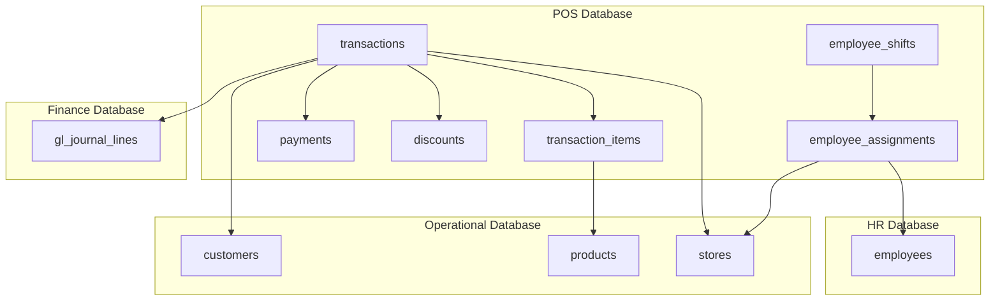

# EuroStyle Point of Sales Database - Technical Schema Documentation

**Supplier**: RetailTech Europe GmbH (Hamburg)  
**System**: EuroStyle POS Platform v3.5  
**Database**: `eurostyle_pos`  
**Technology**: ClickHouse Analytics Database  
**Document Version**: v2.1  
**Last Updated**: October 2024  

---

## 📊 Database Overview

The EuroStyle POS Database manages all point-of-sale transactions across 47+ retail locations in 5 European markets. It provides real-time transaction processing, employee performance tracking, and perfect financial reconciliation with the operational and finance systems.

### System Capabilities
- **Locations Supported**: 47+ retail stores across Europe
- **Daily Transactions**: 1,500+ transactions per day
- **Payment Methods**: Card, Cash, Mobile, Contactless
- **VAT Compliance**: Multi-country European VAT handling
- **Staff Integration**: Connected to HR system for performance tracking

---

## 🗄️ Table Schemas

### 1. transactions
**Purpose**: Core transaction records for all POS sales
```sql
CREATE TABLE transactions (
    transaction_id String,           -- Primary Key: TXN_EU_20241014_000001
    store_id String,                 -- FK: eurostyle_operational.stores.store_id
    employee_id String,              -- FK: eurostyle_hr.employees.employee_id
    customer_id Nullable(String),    -- FK: eurostyle_operational.customers.customer_id
    
    -- Transaction Timing
    transaction_date Date,
    transaction_datetime DateTime,
    transaction_time Time,
    
    -- Shift Information
    shift_id String,                 -- Work shift identifier
    register_number String,          -- POS terminal identifier
    receipt_number String,           -- Human-readable receipt number
    
    -- Financial Details (EUR-based)
    subtotal_amount_eur Decimal64(2), -- Pre-tax amount
    tax_amount_eur Decimal64(2),     -- Total VAT applied
    discount_amount_eur Decimal64(2), -- Total discounts
    total_amount_eur Decimal64(2),   -- Final transaction amount
    
    -- Payment Information
    payment_method String,           -- card, cash, mobile, contactless, split
    payment_status String,           -- completed, voided, refunded, pending
    authorization_code Nullable(String), -- Card authorization code
    
    -- Customer Context
    customer_type String,            -- regular, vip, employee, tourist, loyalty_member
    transaction_type String,         -- sale, return, exchange, void, training
    
    -- Marketing & Loyalty
    promotion_codes Array(String),   -- Applied promotion codes
    loyalty_points_earned UInt32,    -- Points earned in transaction
    loyalty_points_redeemed UInt32,  -- Points redeemed in transaction
    
    -- Country-Specific VAT
    vat_rate_percentage Decimal64(4), -- VAT rate applied (varies by country)
    country_code String,             -- NL, DE, FR, BE, LU
    
    created_at DateTime DEFAULT now(),
    updated_at DateTime DEFAULT now()
) ENGINE = ReplacingMergeTree(updated_at)
ORDER BY transaction_id;
```

**Business Rules**:
- Every transaction must have a valid employee (sales associate)
- VAT rates automatically calculated by customer country
- Receipt numbers sequential per store per day
- Loyalty points calculated real-time with expiry tracking

---

### 2. transaction_items
**Purpose**: Line items for each POS transaction
```sql
CREATE TABLE transaction_items (
    item_id String,                  -- Primary Key: ITEM_EU_20241014_000001
    transaction_id String,           -- FK: transactions.transaction_id
    product_id String,               -- FK: eurostyle_operational.products.product_id
    
    -- Item Details
    item_sequence UInt16,            -- Line number in transaction
    quantity UInt32,                 -- Number of items sold
    
    -- Pricing (EUR-based)
    unit_price_eur Decimal64(2),     -- Actual selling price per unit
    original_price_eur Decimal64(2), -- Original catalog price
    line_discount_amount_eur Decimal64(2), -- Discount applied to this line
    line_total_eur Decimal64(2),     -- Total amount for this line item
    
    -- Tax Calculation
    tax_rate_percentage Decimal64(4), -- VAT rate for this item
    tax_amount_eur Decimal64(2),     -- VAT amount for this line
    
    -- Product Information (Snapshot)
    product_name String,             -- Product name at time of sale
    category_l1 String,              -- Product category level 1
    category_l2 String,              -- Product category level 2
    brand String,                    -- Product brand
    color String,                    -- Product color
    size String,                     -- Product size sold
    
    -- Sales Context
    sales_associate_id String,       -- Employee who sold this item
    discount_reason Nullable(String), -- Reason for discount if applied
    return_eligible Bool,            -- Whether item can be returned
    return_reason Nullable(String),  -- If returned, reason code
    
    created_at DateTime DEFAULT now(),
    updated_at DateTime DEFAULT now()
) ENGINE = ReplacingMergeTree(updated_at)
ORDER BY item_id;
```

**Business Rules**:
- Each line item links to actual product in operational database
- Product information captured at sale time (for historical accuracy)
- Tax calculation varies by product type and customer country
- Return eligibility determined by product category and age

---

### 3. payments
**Purpose**: Detailed payment method breakdown for transactions
```sql
CREATE TABLE payments (
    payment_id String,               -- Primary Key: PAY_EU_20241014_000001
    transaction_id String,           -- FK: transactions.transaction_id
    
    -- Payment Sequence (for split payments)
    payment_sequence UInt8,          -- Order of payment (1, 2, 3...)
    
    -- Payment Method Details
    payment_method String,           -- card, cash, mobile, voucher, loyalty_points
    payment_provider String,         -- visa, mastercard, ec_karte, bancontact, paypal
    amount_eur Decimal64(2),         -- Amount paid with this method
    
    -- Card Payment Details
    card_type Nullable(String),      -- debit, credit, prepaid
    card_last_four Nullable(String), -- Last 4 digits (encrypted)
    authorization_code Nullable(String), -- Bank authorization code
    
    -- Cash Payment Details  
    cash_given_eur Nullable(Decimal64(2)), -- Cash received from customer
    change_given_eur Nullable(Decimal64(2)), -- Change returned
    
    -- Payment Processing
    payment_status String,           -- authorized, captured, declined, refunded, voided
    processing_fee_eur Decimal64(4), -- Transaction fee (if applicable)
    processor_reference String,      -- Payment processor transaction ID
    
    -- Country-Specific Payment Methods
    country_payment_method String,   -- ideal, bancontact, ec_karte, carte_bancaire
    
    -- Security & Compliance
    pci_compliance_token String,     -- PCI-compliant tokenization
    gdpr_consent_logged Bool,        -- Customer data consent recorded
    
    created_at DateTime DEFAULT now(),
    updated_at DateTime DEFAULT now()
) ENGINE = ReplacingMergeTree(updated_at)
ORDER BY payment_id;
```

**Business Rules**:
- Split payments supported (multiple payment methods per transaction)
- Card details tokenized for PCI compliance
- Country-specific payment methods automatically detected
- All payment data GDPR compliant with customer consent

---

### 4. employee_assignments
**Purpose**: Employee work assignments and shift tracking
```sql
CREATE TABLE employee_assignments (
    assignment_id String,            -- Primary Key: ASGN_EU_20241014_000001
    employee_id String,              -- FK: eurostyle_hr.employees.employee_id
    store_id String,                 -- FK: eurostyle_operational.stores.store_id
    
    -- Assignment Details
    assignment_date Date,
    shift_start_time DateTime,
    shift_end_time Nullable(DateTime), -- NULL if shift still ongoing
    
    -- Work Details
    register_number String,          -- Primary POS terminal assigned
    shift_role String,               -- sales_associate, shift_supervisor, manager, trainee
    planned_hours Decimal32(2),      -- Scheduled hours for shift
    actual_hours Nullable(Decimal32(2)), -- Actual hours worked
    break_minutes UInt16,            -- Total break time taken
    
    -- Performance Targets
    sales_target_eur Decimal64(2),   -- Individual shift sales target
    transactions_target UInt32,      -- Target number of transactions
    
    -- Shift Status
    shift_status String,             -- scheduled, active, completed, no_show, sick_leave
    clock_in_time Nullable(DateTime), -- Actual clock in time
    clock_out_time Nullable(DateTime), -- Actual clock out time
    
    -- Supervisor Information
    supervisor_id Nullable(String),  -- Supervising employee ID
    training_session Bool,           -- Whether this is a training shift
    
    created_at DateTime DEFAULT now(),
    updated_at DateTime DEFAULT now()
) ENGINE = ReplacingMergeTree(updated_at)
ORDER BY assignment_id;
```

**Business Rules**:
- Employees must clock in/out for accurate hour tracking
- Break time automatically calculated based on local labor laws
- Sales targets calculated based on historical performance
- Training sessions tracked separately for HR development

---

### 5. discounts
**Purpose**: Discount and promotion tracking
```sql
CREATE TABLE discounts (
    discount_id String,              -- Primary Key: DISC_EU_20241014_000001
    transaction_id String,           -- FK: transactions.transaction_id
    item_id Nullable(String),        -- FK: transaction_items.item_id (NULL for transaction-level)
    
    -- Discount Details
    discount_type String,            -- percentage, fixed_amount, buy_x_get_y, loyalty, employee
    discount_name String,            -- Human-readable discount name
    discount_code Nullable(String),  -- Promotion code if applicable
    
    -- Discount Calculation
    original_amount_eur Decimal64(2), -- Amount before discount
    discount_amount_eur Decimal64(2), -- Actual discount applied
    final_amount_eur Decimal64(2),   -- Amount after discount
    discount_percentage Nullable(Decimal32(4)), -- Percentage if applicable
    
    -- Promotion Context
    promotion_campaign String,       -- Marketing campaign name
    promotion_start_date Date,       -- Campaign start date
    promotion_end_date Date,         -- Campaign end date
    
    -- Authorization
    authorized_by String,            -- Employee who authorized discount
    authorization_reason String,     -- Reason for discount (damage, loyalty, etc.)
    manager_override Bool,           -- Whether manager override was required
    
    -- Eligibility
    customer_eligibility String,    -- all, loyalty_members, employees, seniors
    minimum_purchase_eur Nullable(Decimal64(2)), -- Minimum purchase required
    maximum_discount_eur Nullable(Decimal64(2)), -- Maximum discount allowed
    
    created_at DateTime DEFAULT now(),
    updated_at DateTime DEFAULT now()
) ENGINE = ReplacingMergeTree(updated_at)
ORDER BY discount_id;
```

**Business Rules**:
- Manager override required for discounts > 20%
- Loyalty discounts automatically applied based on tier
- Employee discounts tracked for tax compliance
- Campaign discounts validate against date ranges

---

### 6. employee_shifts
**Purpose**: Detailed employee shift scheduling and performance
```sql
CREATE TABLE employee_shifts (
    shift_id String,                 -- Primary Key: SHIFT_EU_20241014_000001
    employee_id String,              -- FK: eurostyle_hr.employees.employee_id
    store_id String,                 -- FK: eurostyle_operational.stores.store_id
    
    -- Shift Timing
    shift_date Date,
    planned_start Time,
    planned_end Time,
    actual_start Nullable(Time),
    actual_end Nullable(Time),
    
    -- Hours Tracking
    planned_hours Decimal32(2),
    actual_hours Nullable(Decimal32(2)),
    overtime_hours Nullable(Decimal32(2)),
    break_duration_minutes UInt16,
    
    -- Performance Metrics
    transactions_handled UInt32,
    items_sold UInt32,
    total_sales_eur Decimal64(2),
    average_transaction_eur Decimal32(2),
    
    -- Goals & Targets
    hourly_sales_target_eur Decimal64(2),
    target_achievement_percentage Nullable(Decimal32(2)),
    
    -- Shift Context
    shift_type String,               -- regular, training, overtime, holiday
    shift_notes Nullable(String),    -- Manager notes about shift
    weather_impact String,           -- sunny, rainy, snowy (affects foot traffic)
    
    created_at DateTime DEFAULT now(),
    updated_at DateTime DEFAULT now()
) ENGINE = ReplacingMergeTree(updated_at)
ORDER BY shift_id;
```

---

### 7. promotions
**Purpose**: Active promotions and marketing campaigns
```sql
CREATE TABLE promotions (
    promotion_id String,             -- Primary Key: PROMO_EU_FALL2024_001
    promotion_name String,           -- "Fall Fashion Week 2024"
    promotion_code String,           -- Customer-facing code
    
    -- Campaign Timing
    start_date Date,
    end_date Date,
    active_hours String,             -- "09:00-21:00" or "all_day"
    
    -- Discount Rules
    discount_type String,            -- percentage, fixed_amount, bogo, bundle
    discount_value Decimal32(4),     -- Percentage or fixed amount
    minimum_purchase_eur Nullable(Decimal64(2)),
    maximum_discount_eur Nullable(Decimal64(2)),
    
    -- Eligibility
    customer_segments Array(String), -- ["loyalty_gold", "new_customers"]
    product_categories Array(String), -- ["Women", "Accessories"]
    store_locations Array(String),   -- Applicable stores
    
    -- Usage Limits
    usage_limit_per_customer Nullable(UInt32),
    total_usage_limit Nullable(UInt32),
    current_usage_count UInt32,
    
    -- Performance Tracking
    revenue_impact_eur Decimal64(2),
    transactions_count UInt32,
    average_basket_size_eur Decimal32(2),
    
    created_at DateTime DEFAULT now(),
    updated_at DateTime DEFAULT now()
) ENGINE = ReplacingMergeTree(updated_at)
ORDER BY promotion_id;
```

---

### 8. store_daily_summaries
**Purpose**: Daily store performance aggregations
```sql
CREATE TABLE store_daily_summaries (
    summary_id String,               -- Primary Key: SUM_STORE_NL_001_20241014
    store_id String,                 -- FK: eurostyle_operational.stores.store_id
    summary_date Date,
    
    -- Operating Hours
    opening_time Time,
    closing_time Time,
    actual_operating_hours Decimal32(2),
    
    -- Staffing
    planned_staff_count UInt16,
    actual_staff_count UInt16,
    total_staff_hours Decimal32(2),
    
    -- Transaction Summary
    total_transactions UInt32,
    total_items_sold UInt32,
    total_customers_served UInt32,
    
    -- Financial Summary (EUR)
    gross_sales_eur Decimal64(2),
    net_sales_eur Decimal64(2),     -- After returns
    tax_collected_eur Decimal64(2),
    discounts_applied_eur Decimal64(2),
    
    -- Payment Breakdown
    cash_sales_eur Decimal64(2),
    card_sales_eur Decimal64(2),
    mobile_sales_eur Decimal64(2),
    other_sales_eur Decimal64(2),
    
    -- Performance Metrics
    average_transaction_eur Decimal32(2),
    items_per_transaction Decimal32(2),
    sales_per_hour_eur Decimal32(2),
    sales_per_staff_eur Decimal32(2),
    
    -- Operational Context
    weather_condition String,        -- sunny, cloudy, rainy, snowy
    special_events Array(String),    -- Local events affecting traffic
    foot_traffic_estimate UInt32,    -- Estimated store visitors
    
    -- Targets & Goals
    daily_target_eur Decimal64(2),
    target_achievement_percentage Decimal32(2),
    
    created_at DateTime DEFAULT now(),
    updated_at DateTime DEFAULT now()
) ENGINE = ReplacingMergeTree(updated_at)
ORDER BY (store_id, summary_date);
```

---

## 🔗 Database Relationships

### Cross-Database Integration:


### Key Relationships:
- `transactions.customer_id` → `eurostyle_operational.customers.customer_id`
- `transactions.store_id` → `eurostyle_operational.stores.store_id`
- `transaction_items.product_id` → `eurostyle_operational.products.product_id`
- `employee_assignments.employee_id` → `eurostyle_hr.employees.employee_id`
- **Perfect Revenue Reconciliation**: `SUM(transactions.total_amount_eur)` = Finance GL entries

---

## 🌍 European VAT & Payment Compliance

### Country-Specific VAT Rates:
- **Netherlands**: 21% standard VAT
- **Germany**: 19% standard VAT
- **France**: 20% standard VAT
- **Belgium**: 21% standard VAT
- **Luxembourg**: 17% standard VAT

### Preferred Payment Methods by Country:
- **Netherlands**: iDEAL (60%), Bancontact (25%), Cards (15%)
- **Germany**: EC-Karte (45%), Cash (30%), Credit Cards (25%)
- **France**: Carte Bancaire (50%), Cards (35%), Cash (15%)
- **Belgium**: Bancontact (55%), Maestro (25%), Cards (20%)
- **Luxembourg**: Credit Cards (60%), SEPA (25%), Cash (15%)

---

## 📊 Performance & Optimization

### Primary Indexes:
- `transactions`: `transaction_id`
- `transaction_items`: `item_id`
- `payments`: `payment_id`
- `employee_assignments`: `assignment_id`

### Recommended Analytics Indexes:
```sql
-- Sales analysis
ALTER TABLE transactions ADD INDEX idx_date_store (transaction_date, store_id) TYPE minmax GRANULARITY 1000;
ALTER TABLE transactions ADD INDEX idx_employee employee_id TYPE set(1000) GRANULARITY 1000;

-- Product performance
ALTER TABLE transaction_items ADD INDEX idx_product product_id TYPE bloom_filter GRANULARITY 4096;
ALTER TABLE transaction_items ADD INDEX idx_category category_l1 TYPE set(50) GRANULARITY 1000;

-- Financial reconciliation
ALTER TABLE transactions ADD INDEX idx_amount total_amount_eur TYPE minmax GRANULARITY 8192;
```

---

## 🔒 Security & Compliance

### PCI DSS Compliance:
- All card data tokenized using PCI-compliant tokens
- No sensitive card data stored in database
- Access logs maintained for all payment data queries

### GDPR Compliance:
- Customer consent tracked for all payment data
- Right to erasure: 30-day SLA for data removal
- Personal payment data encrypted at rest

---

## 🔧 Integration APIs

### REST API Base URL:
`https://api.eurostyle-pos.com/v3.5/`

### Key Endpoints:
- **Transactions**: `GET/POST /transactions/{transaction_id}`
- **Daily Sales**: `GET /stores/{store_id}/daily-summary/{date}`
- **Employee Performance**: `GET /employees/{employee_id}/performance`
- **Real-time Dashboard**: `GET /stores/{store_id}/live-metrics`

### Real-time Webhooks:
- Transaction completion notifications
- Payment failure alerts
- End-of-shift summaries
- Inventory updates

---

## 📞 Technical Support

**RetailTech Europe GmbH**  
POS Systems Division  
Email: `pos-support@retailtech-europe.com`  
Phone: `+49 40 555 0456`  
Hours: 24/7 for critical POS issues

**SLA**:
- Critical POS Down: 1 hour
- Payment Issues: 30 minutes
- Standard Issues: 8 hours
- Enhancement Requests: 2 weeks

---

*© 2024 RetailTech Europe GmbH - Confidential POS Technical Documentation*