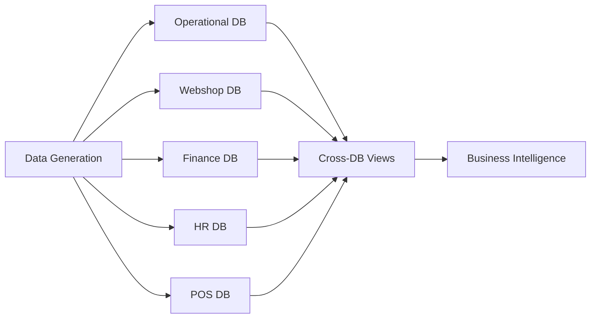

# EuroStyle Fashion - Database Initialization Scripts

This directory contains the complete database initialization and setup scripts for the EuroStyle Fashion retail analytics platform.

## 📁 Directory Structure

```
init-scripts/
├── 00_master_init.sql          # Master database initialization
├── databases/                   # Database table creation scripts
│   ├── 01_operational_tables.sql   # Operational/ERP database
│   ├── 02_webshop_tables.sql       # E-commerce analytics database  
│   ├── 03_finance_tables.sql       # Financial management database
│   ├── 04_hr_tables.sql            # HR & European compliance database
│   └── 05_pos_tables.sql           # Point of Sale database
├── views/                       # Cross-database analytical views
│   └── 01_cross_database_views.sql # Business intelligence views
├── indexes/                     # Performance optimization
│   └── 01_performance_indexes.sql  # Materialized views for speed
├── procedures/                  # Stored procedures (future)
├── seed-data/                   # Initial reference data (future)
├── utility/                     # Utility and maintenance scripts (future)
└── archive/                     # Backup of original scripts
```

## 🚀 Database Architecture

EuroStyle Fashion implements a **5-database architecture** for comprehensive retail analytics:

### 1. 📊 Operational Database (`eurostyle_operational`)
- **Purpose**: Core ERP and business operations
- **Tables**: 9 core tables
- **Key Entities**: Customers, Products, Orders, Stores, Inventory
- **Use Cases**: Transaction processing, inventory management, customer management

### 2. 🌐 Webshop Database (`eurostyle_webshop`) 
- **Purpose**: E-commerce analytics and customer behavior
- **Tables**: 10 behavioral tracking tables
- **Key Entities**: Sessions, Page Views, Cart Activities, Reviews, Analytics
- **Use Cases**: Conversion analysis, personalization, A/B testing

### 3. 🏦 Finance Database (`eurostyle_finance`)
- **Purpose**: Financial management and IFRS compliance
- **Tables**: 14 financial management tables  
- **Key Entities**: GL Entries, Legal Entities, Budgets, Assets
- **Use Cases**: Financial reporting, consolidation, compliance

### 4. 👥 HR Database (`eurostyle_hr`)
- **Purpose**: Human resources and European employment law compliance
- **Tables**: 13 HR management tables
- **Key Entities**: Employees, Contracts, Leave, Performance, Training
- **Use Cases**: Workforce management, compliance, performance tracking

### 5. 🏪 POS Database (`eurostyle_pos`)
- **Purpose**: Point of sale transactions and in-store operations
- **Tables**: 8 transaction management tables
- **Key Entities**: Transactions, Payments, Discounts, Shifts
- **Use Cases**: Store operations, sales analysis, cash management

## 📋 Initialization Order

Execute scripts in the following order for proper setup:

### 1. Master Database Creation
```bash
clickhouse-client --multiquery --queries-file init-scripts/00_master_init.sql
```
Creates all 5 databases with proper configuration.

### 2. Table Creation
```bash
# Execute in order:
clickhouse-client --multiquery --queries-file init-scripts/databases/01_operational_tables.sql
clickhouse-client --multiquery --queries-file init-scripts/databases/02_webshop_tables.sql  
clickhouse-client --multiquery --queries-file init-scripts/databases/03_finance_tables.sql
clickhouse-client --multiquery --queries-file init-scripts/databases/04_hr_tables.sql
clickhouse-client --multiquery --queries-file init-scripts/databases/05_pos_tables.sql
```

### 3. Analytical Views (Optional)
```bash
clickhouse-client --multiquery --queries-file init-scripts/views/01_cross_database_views.sql
```
Creates cross-database views for business intelligence.

### 4. Performance Indexes (Optional)
```bash
clickhouse-client --multiquery --queries-file init-scripts/indexes/01_performance_indexes.sql
```
Creates materialized views for optimal query performance.

## 🔧 Integration with EuroStyle Scripts

The main `eurostyle.sh` script automatically uses these initialization scripts:

```bash
# Setup database structure
./eurostyle.sh setup

# This will execute:
# - 00_master_init.sql
# - databases/01_operational_tables.sql  
# - databases/02_webshop_tables.sql
# - databases/03_finance_tables.sql
# - databases/04_hr_tables.sql
# - databases/05_pos_tables.sql (NEW!)
```

## 📊 Cross-Database Views

The analytical views provide unified business intelligence across all databases:

- **`customer_360_view`**: Complete customer profile with omnichannel behavior
- **`product_performance_view`**: Product sales and engagement metrics
- **`store_dashboard_view`**: Store performance with health scores
- **`revenue_reconciliation_view`**: Financial-operational data reconciliation
- **`employee_performance_view`**: HR performance analytics

### Example Usage
```sql
-- Get omnichannel customer insights
SELECT customer_type, COUNT(*) as customers,
       AVG(operational_spent_eur) as avg_spent
FROM eurostyle_operational.customer_360_view
GROUP BY customer_type;

-- Analyze product performance across channels  
SELECT category_l1, performance_tier,
       AVG(purchase_conversion_rate) as avg_conversion
FROM eurostyle_operational.product_performance_view
WHERE stock_status = 'IN_STOCK'
GROUP BY category_l1, performance_tier;
```

## ⚡ Performance Optimization

The materialized views act as high-performance indexes:

- **Customer Activity**: Pre-aggregated customer metrics
- **Product Sales**: Product performance summaries
- **Session Funnels**: Webshop conversion analysis
- **Financial Summaries**: GL and budget aggregations
- **Store Performance**: Daily operational metrics

These views automatically update as new data arrives, providing instant query responses.

## 🔄 Data Flow Integration

The databases integrate seamlessly with the data generation pipeline:



## 🛠️ Maintenance

### Rebuilding from Scratch
```bash
# Clean and rebuild everything
./eurostyle.sh clean
./eurostyle.sh setup
./eurostyle.sh demo-fast  # or demo-full
```

### Updating Views and Indexes
```bash
# Re-run analytical components
clickhouse-client --multiquery --queries-file init-scripts/views/01_cross_database_views.sql
clickhouse-client --multiquery --queries-file init-scripts/indexes/01_performance_indexes.sql
```

## 📚 Key Features

✅ **Complete Coverage**: All 5 business domains covered  
✅ **European Compliance**: GDPR, employment law, IFRS standards  
✅ **Performance Optimized**: Materialized views for speed  
✅ **Cross-Database Analytics**: Unified business intelligence  
✅ **Referential Integrity**: Proper foreign key relationships  
✅ **Scalable Design**: Handles both demo and production volumes  
✅ **Integration Ready**: Works with existing data generation pipeline  

## 🔗 Related Documentation

- **Main README**: `../README.md`
- **Data Generation**: `../scripts/README.md`
- **System Management**: `../scripts/system-management/README.md`
- **Database Schema**: See individual SQL files for detailed table documentation

## 🆘 Troubleshooting

### Common Issues

1. **Container Not Running**
   ```bash
   ./eurostyle.sh start
   ```

2. **Permission Issues**
   ```bash
   chmod +x init-scripts/*.sql
   ```

3. **View Creation Failures**  
   - Ensure all tables exist before creating views
   - Check ClickHouse version compatibility

4. **Performance Issues**
   - Run performance indexes script
   - Check materialized view status
   - Verify proper table ordering keys

### Verification Commands

```bash
# Check all databases exist
clickhouse-client --query="SHOW DATABASES LIKE 'eurostyle_%'"

# Count tables per database  
clickhouse-client --query="
SELECT database, COUNT(*) as tables
FROM system.tables 
WHERE database LIKE 'eurostyle_%'
GROUP BY database
ORDER BY database"

# Verify views exist
clickhouse-client --query="
SELECT database, name 
FROM system.tables 
WHERE engine = 'View' AND database LIKE 'eurostyle_%'"
```

---

**EuroStyle Fashion Database Platform** - Complete retail analytics foundation for European fashion retail operations. 🏪✨